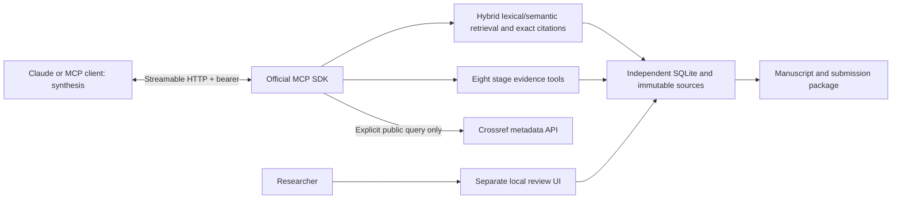

> Historical 0.2.4 documentation. For the current Qdrant/Ollama migration and changed job contract, see [migration record](qdrant-migration.md) and [current README](../README.md).

# Implementation scope and evidence

User authorization: create an independent RAG MCP server with Streamable HTTP and tools spanning the eight stages discussed in the conversation; keep it separate from the existing system; use a subdirectory prefixed `codex-`. Confirmed path: `2026-TTS-AI/codex-research-rag-mcp`.

## Architecture

No imports, writes or migrations to the sibling `tts_research` runtime. The new package has its own lockfile, database, sources, exports, review UI and token. [Docker Compose](../compose.yaml) runs MCP and review as separate containers built from the same image. Both mount the local `.data` directory at `/data`. Their listeners bind `0.0.0.0` inside the containers, while published host ports are restricted to `127.0.0.1`. Direct Python execution still defaults to loopback. Parent README navigation is updated as required by the repository instructions.

## Evidence and persistence

- File content SHA-256 IDs, original bytes, extracted text checksum, zero-based physical page plus character offsets. Text-based files are one logical page.
- Page-preserving overlapping chunks. BM25 uses Unicode normalization for matching while offsets retain original text. Lexical Thai matching uses character 2/3-grams. Semantic retrieval uses pinned multilingual-e5-base CPU embeddings (768 dimensions), query/passage prefixes, masked mean pooling and L2 normalization. Overflow token windows are pooled; originals and their offsets remain untouched. Hybrid combines full lexical and cosine rankings with reciprocal rank fusion (k=60). No external translation or inference service is called.
- SQLite transactions serialize writes. Expected revision prevents stale edits. Idempotency keys return the original response for identical retries and reject reused keys with changed inputs.
- Stage artifacts preserve superseded versions. Blocks distinguish evidence, proposal, researcher input, analysis result and unresolved content. Direct exact citations and explicit versioned artifact dependencies permit mechanical integrity checks.
- Corpus changes conservatively make earlier artifacts stale. This reports a review requirement, not that all old conclusions are false. Updating dependent content resets acceptance; historical versions remain available.
- Acceptance is exposed only in a separate loopback HTTP review application. The local owner's identity is self-declared; the workspace is not a multi-user security boundary or tamper-proof audit log.
- Backups snapshot SQLite and exactly the original files referenced by that snapshot. Export records the revision, evidence, supplied bibliography and file hashes.

## Deliberate boundaries

The server provides retrieval and evidence management; the connected client supplies generation. It is not a stand-alone LLM, semantic judge or autonomous scientist. Stage tools return task-specific live context and schemas; `save_artifact` persists the client's actual output. Code/protocol tests cannot demonstrate the quality of a client's synthesis.

Crossref discovery records queries, filters, timestamps and one page of metadata. It does not provide comprehensive systematic searching, read full texts, prove novelty, download paywalled PDFs or automatically monitor new papers. Full text must be imported with authorization. Original journal policies must be supplied, not invented from a journal name.

PDF ingestion does not OCR scans, reconstruct complex tables, or guarantee correct reading order. Empty extracted pages are flagged. CSV summaries count real rows and finite values, but do not fit models, run experiments or choose statistical tests. General source-role labels are declared by the importer, not a verification that data are authentic.

`prepare_submission` performs structural, integrity and review checks. The client and researcher still compare the actual journal rules and verify semantic citation support, scientific validity, authorship, disclosures and completeness. Local export never sends a manuscript to a journal. There is no cloud deployment, public tunnel, GPU, remote container mutation or external model billing.

## Before implementation

The authorized new subdirectory was empty. The existing sibling system was inspected only: version 0.4.0 exposed stdio and literal PDF search. Its attempted HTTP CLI invocation exited 2 (unrecognized transport/port arguments). This observation is context, not a defect fixed in that sibling package. Its baseline suite had 15 passes and a loopback-bind failure in the sandbox (`Operation not permitted`); no sibling code was changed to bypass that restriction.

New checks run the actual new server with the official SDK client and real source documents. Permission to bind local sockets is requested from the sandbox when required; tests do not replace the server or transport with mocks. Dependency provenance was captured before server implementation from installed original distributions; a stale empty `tts_research-0.2.0.dist-info` directory was recorded explicitly instead of treated as a distribution. Recapture in the independent environment contains only its installed dependencies.

## Document identity and search storage (0.2.0)

Schema 3 migrates legacy source rows and keeps every old chunk ID and exact page citation. New logical documents receive a document_id; explicitly linked new file bytes increment source_version. source_id remains the original byte SHA-256. text_revision_id tracks extracted-page text; chunk_set_id identifies a split configuration, and chunk_id preserves a span within a set. New imports index before the transaction succeeds. Legacy sources require an explicit rebuild_search_index; semantic requests fail clearly while the index is missing, without an automatic fallback.

SQLite stores document/artifact history, chunks and float32 embedding BLOBs with text/model/vector hashes. Cosine ranking scans selected active chunks from latest document versions; explicit source_ids select historical versions. This has linear scan cost and is not a dedicated vector database or approximate-neighbor index. Large-corpus speed and capacity are unverified. The user's vector-database preference remains an open follow-up; no separate database service has been inferred as authorized from the question alone.

Chunk sets and excluded/needs_review chunks remain readable and backed up. Activation chooses one set per source. Exclusion is a chunk-level decision for that set; it does not redact text from overlapping chunks or permanently blacklist a source span across later sets. Inspect/review a replacement set before activation. find_evidence_usage locates overlapping citations in all artifact versions. Active-set withheld citations flag current artifacts for review. Manuscript IDs and revisions are independent of source/chunk IDs.

See [ingestion and responsibility](ingestion.md), [all tool contracts](tools.md), and [Codex retrieval assessment with unresolved cases](semantic-assessment-2026-09-20.md).
